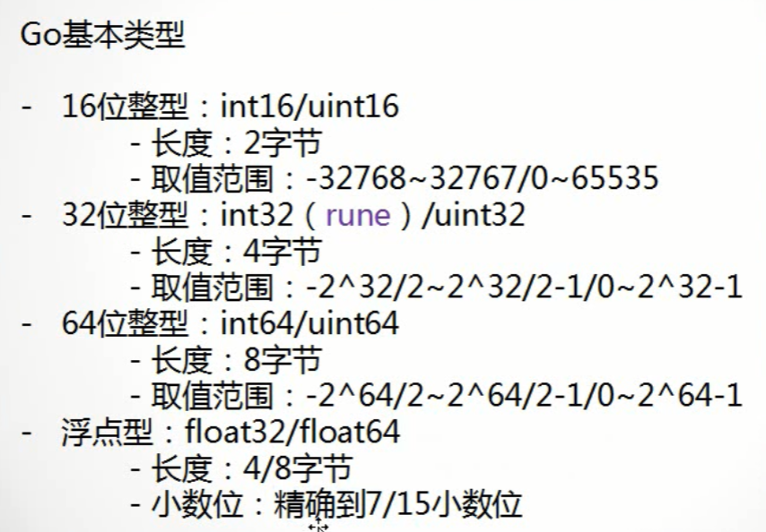
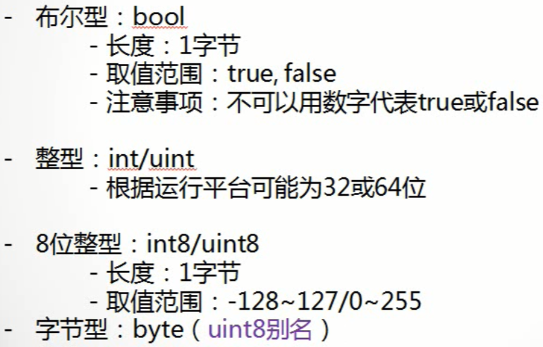
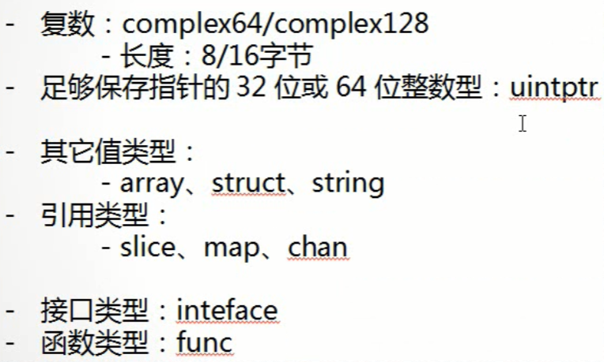
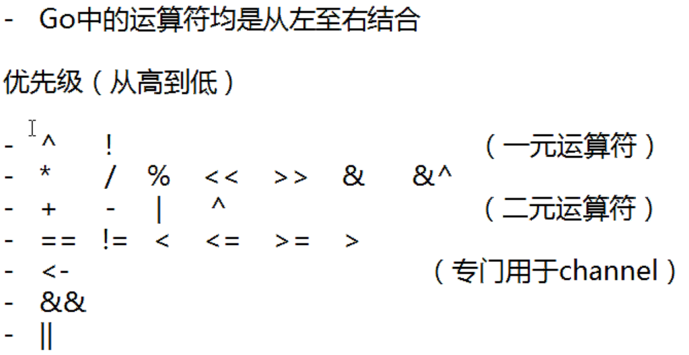

# Go语言学习笔记 Day01
[TOC]

[comment]: <注释：目录结构> ([TOC]、[TOCM])

### [Day02](http://njgit.jsaepay.com/wangwei/golang-study/src/branch/master/huqi/Day_02)

### Go 语言最主要的特性：
	自动垃圾回收
	更丰富的内置类型
	函数多返回值
	错误处理
	匿名函数和闭包
	类型和接口
	并发编程
	反射
	语言交互性

##### 1. 使用元组方式定义多个变量，一行一个，若放在同一行，则使用“;”号间隔
##### 2. 所有引用的包都必须都要进行使用，否则程序将报错。
##### 3. Println("")  等同于Print("\n")
##### 4. 函数体内不能使用定义全局变量组
##### 5. 不建议使用省略调用，因省略调用无法判别
##### 6. 基本类型：bool、int/uint、int8/uint8（2^8=256,-128~127，0-255）、byte（uint8）、chan通道（并发使用）

##### 7. 零值，即默认的赋值，int、float32、byte默认为0，string默认为空字符串，bool默认为false
##### 8. 与其他语言的区别，无float、double等类型，float需指明32还是64.
##### 9. 可以使用type关键字自定义类型，类似于别名，但实际并不能说是别名，而只是底层数据结构相同，在进行类型转换时仍旧需要显示转换
##### 10. 单个变量声明与赋值：

	变量声明：var <变量名称> <变量类型>
	变量赋值：<变量名称> = <表达式>
	声明的同时赋值：var <变量名称> <变量类型> = <表达式>
	变量声明与赋值的最简写法：d := 1  （省略var关键字，同时使用系统自动判断类型）

##### 11. 多个变量声明与赋值：

	全局变量的声明可使用var()的方式进行简写
	全局变量的声明不可以省略var，但可使用并行方式
	所有变量都可以使用类型推断
	局部变量不可以使用var()的方式简写，只能使用并行方式 （此处有误，可以这么写但不建议）
	var a, b, c, d int
	a, b, c, d = 1, 2, 3, 4
	i, p, n, o := 13, 14, 15, 16

##### 12. 空白符：将变量赋值给“_”，可用于忽略某个返回值
##### 13. Go语言不存在隐式转换，所有类型必须显示声明，且转换只能发生在两种相互兼容的类型之间，bool与int型不兼容，不可转换。当int转为string时会首先从ASCII中进行对照转换，如65—>A

	//在相互兼容的两种类型之间进行转换
	var e float32 = 1.1
	g := int(e)
	//以下表达式无法通过编译
	//var h bool = true
	//j := int(h)
	//int->string
	var h int = 65
	j := string(h)  //A
	//不进行变换
	k := strconv.Itoa(h)  // 65
	h, _ = strconv.Atoi(k)  // 65

##### 14. 常量

	//当常量未被赋值时将使用上行表达式的值
	//常量的值在编译时就已经确定
	//常量的定义格式与变量基本相同
	//等号右侧必须是常量或者常量表达式
	//常量表达式中的函数必须是内置函数
	//常量赋值时，下行不提供初始值时，上下两行数目必须一致，否则编译不通过
	upA1, upA2 = 1, "2"
	upA3, upA4
	//iota是常量的计数器，从0开始，组中每定义一个常量自动递增1
	//通过初始化规则与iota可以达到枚举的效果
	//每遇到一个const关键字，iota就会重置为0
	const (
		iota1 = iota // 0
	)
	const (
		iota2 = 'A' // 65
		iota3 = iota  // 1
		iota4 = 'B'  // 66
		iota5 = iota  //2
	)

##### 15. 运算符

