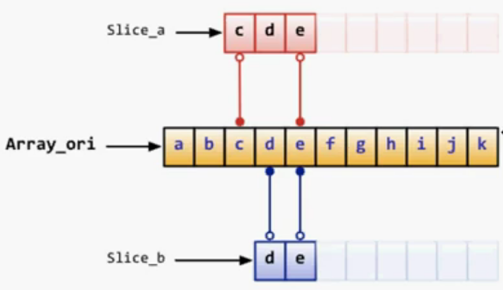

# Go语言学习笔记 Day02

### [Day01](http://njgit.jsaepay.com/wangwei/golang-study/src/branch/master/huqi/Day_01)
### [Day03](http://njgit.jsaepay.com/wangwei/golang-study/src/branch/master/huqi/Day_03)

### 1. 运算符

	 6: 0110
	11: 1011
	------------
	&   0010 = 2  同时为1才为1
	|   1111 = 15 只要有1就为1
	^   1101 = 13 只能有一个1，则为1，若有两个1，则为零
	&^  0100 = 4  看第二个若为1则为0，若为0，则直接看第一个

### 2. 指针

	Go中不支持指针运算以及“->”运算符，使用“*”通过指针间接访问目标对象
	默认值为nil而非NULL

### 3. 递增递减语句中“++”、“--”是作为语句而并不是作为表达式，不可使用“++a”，只可放置后面

### 4. if条件语句
	条件判断无小括号，if体有大括号且位于条件语句同一行
	同时在条件判断中可在一开始初始化变量，然后使用“;”号分隔条件，初始化的变量只在if体内有效，若初始化变量名与外部变量名相同，则会在if体内被覆盖

### 5. for循环语句
	Go只有for一个循环语句关键字，但支持3种形式
	初始化和步进表达式可以是多个值
	条件语句每次循环都会被重新检查，因此不建议在条件语句中使用函数，尽量提前计算好条件并以变量或常量代替

```go
	//条件语句
	for a < 3 {  //等同于white语句
		if a == 1{
			f.Println("符合条件输出！")
		}else {
			f.Println("不符合条件输出！")
		}
		a++
	}
	for i := 2 ; i <= 5 ; i++ {
		f.Println(i)
	}
```

### 6. switch选择条件语句
	可以使用任何类型或表达式作为条件语句
	不需要写break，一旦条件符合自动终止
	如希望继续执行下一个case，需使用fallthrough语句
	支持一个初始化表达式（可以是并行方式），右侧需跟分号
	左大括号必须和条件语句在同一行

```go
	switch1 := 4
	switch switch1 {
	case 4:
		f.Println("switch1==4")
	default:
		f.Println("默认输出")
	}
	switch { //也可在此处进行初始化变量 switch switch1 := 4{
	case switch1 >= 2:
		f.Println("进入后判断变量值。")
		fallthrough
	case switch1 > 4:
		f.Println("使用fallthrough命令让其判断下一个case。")
	case switch1 <= 5:
		f.Println("上一个为true且未使用fallthrough命令让其判断case。")
	}
```

### 7. 跳转语句goto、break、continue
	三个语法标签可以配合标签使用
	标签名区分大小写，若不使用会造成编译错误
	Break与continue配合标签可用于多层循环的跳出
	Goto是调整执行位置，与其他两个语句配合标签的结果并不相同

```go
	//跳转语句
	LABEL:
		for true {
			Label:
			for i := 0; i < 10; i++ {
				if i == 1 {
					//跳过中间的判断，少输出一个1
					goto goLaebl
				}
				if i >2 {
					//使用跳转语句跳出死循环
					break LABEL
				} else {
					f.Println(i)
				}
				goLaebl:
				//死循环使用跳转语句跳出
				for true {
					f.Println(i)
					continue Label
				}
			}
		}
```

### 8. 数组Array
	数组设置：[2]int{1,2}
	定义数组的格式：var <varName> [n]<type>  (n>=0)
	数组长度也是类型的一部分，因此具有不同长度的数组为不同类型，不同类型不能比较
	已知某一下标数时，使用“下标:值”表示
	不确定数组长度时，使用“...”表示
	注意区分指向数组的指针和指针数组
	数组在Go中为值类型
	数组之间可以用==或!=进行比较，但不可以使用<或>
	可以使用new来创建数组，此方法返回一个指向数组的指针
	Go支持多维数组，动态多维数组，最内层不可省略指定大小

```go
	a := [2]int{1,2}
	f.Println(a)
	b := [2]int{2}
	f.Println("不足长度时自动设置初始值：",b)  //[2 0]
	c := [20]int{1,2,19:1}
	f.Println("已知某一下标数时，使用“下标:值”表示：",c)  //[1 2 0 0 0 0 0 0 0 0 0 0 0 0 0 0 0 0 0 1]
	d := [...]int{1,2,5:5,9:9}
	f.Println("不确定数组长度时，使用“...”表示：",d)  //[1 2 0 0 0 5 0 0 0 9]
	var e *[10]int = &d
	f.Println("指向数组的指针：",e)  //&[1 2 0 0 0 5 0 0 0 9]
	g := [...]*int{&a[0],&a[1]}
	f.Println("指向指针的数组：",g)  //[0xc0000100e0 0xc0000100e8]
	h1 := [2]int{1,2}
	h2 := [2]int{1,3}
	//h3 := [1]int{3}
	f.Println("数组比较：",a==h1)  //true
	f.Println("数组比较：",h1==h2)  //false
	//f.Println("不同类型不可比较：",h2==h3)
	i := new([10]int)
	i[3] = 3
	f.Println("使用new关键字创建指向数组的指针：",i)  //&[0 0 0 3 0 0 0 0 0 0]
	j := [2][3]int{{1,2},{3,4}}
	f.Println("多维数组：",j)   //[[1 2 0] [3 4 0]]
	k := [...][3]int{{1,2},{3,4},{5,6}}
	f.Println("动态多维数组，最内层不可省略指定大小：",k)  //[[1 2 0] [3 4 0] [5 6 0]]
```

### 9. 切片Slice
	其本身并不是数组，它指向底层的数组
	作为变长数组的替代方案，可以关联底层数组的局部或全部
	为引用类型
	可以直接创建或从底层数组获取生成
	使用len()获取元素个数，cap()获取容量
	一般使用make()创建，也可直接声明
	如果多个slice指向相同底层数组，其中一个的值改变会影响全部
	make([]T,len,cap) 其中cap可以省略，则和len的值相同
	len表示存数的元素个数，cap表示初始容量，cap成倍数增长
	声明slice：var si []int
	切片从数组取值时类似于python的切片
	Reslice
		Reslice时索引被slice的切片为准
		索引不可以超过被slice的切片的容量cap()值
		索引越界不会导致底层数组的重新分配而是引发错误
	Append
		可以在slice尾部追加元素
		可以将一个slice追加在另一个slice尾部
		如果最终长度未超过追加到slice的容量则返回原始slice
		如果超过追加到的slice的容量则将重新分配数组并拷贝原始数据
	Copy

```go
	var si []int
	f.Println("直接声明Slice：",si)
	s1 := make([]int, 3, 10)
	f.Println("s1：", s1, "长度：",len(s1), "容量：", cap(s1))
	s2 := []byte{'a', 'b', 'c', 'd', 'e', 'f', 'g', 'h', 'i', 'j', 'k', 'l', 'm', 'n'}
	sa := s2[2:5]
	f.Println(len(sa), cap(sa))
	sb := sa[9:11]
	f.Println(string(sb))
	s3 := make([]int, 3, 6)
	f.Printf("%p\n",s3)
	s3 = append(s3, 1, 2, 3)
	f.Printf("容量还可存放：%v %p\n", s3, s3)
	s3 = append(s3, 1, 2, 3)
	f.Printf("超出容量开拓新的空间地址：%v %p\n", s3, s3)
	s4 := s2[2:5]
	s5 := s2[1:3]
	f.Println(s4, s5)
	s4[0] = 9
	f.Println("多个切片指向一个相同地址时，改变地址数据，所有切片数据都会改变：", s4, s5)
	s2 = append(s2, 'o','p','q','r','s','t')
	s4[1] = 9
	f.Println("但当切片扩容后地址改变，切片数据就不会同步：",s4, s5)
	s6 := []int{1,2,3,4,5,6}
	s7 := []int{7,8,9}
	copy(s6,s7)
	f.Println("第二个替换到第一个里，若第二个长，则以第一个长度取第二个：",s6)  //[7 8 9 4 5 6]
	s8 := s6[:]
	f.Println("完整截取：",s8)
```
