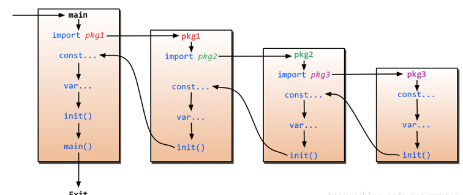
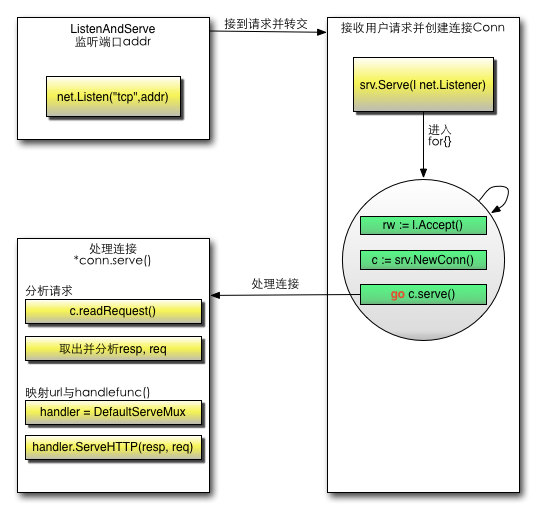

# Go语言学习笔记 Day06

### [Day05](http://njgit.jsaepay.com/wangwei/golang-study/src/branch/master/huqi/Day_05)
### [Day07](http://njgit.jsaepay.com/wangwei/golang-study/src/branch/master/huqi/Day_07)

------------


####[W3C  Go Web 编程](https://www.w3cschool.cn/yqbmht/)

### 1. 知识补充
	获取远程包
	go语言有一个获取远程包的工具就是go get，目前go get支持多数开源社区(例如：github、googlecode、bitbucket、Launchpad)
	go get github.com/astaxie/beedb
	go get -u 参数可以自动更新包，而且当go get的时候会自动获取该包依赖的其他第三方包
	import "github.com/astaxie/beedb"

	以上 $GOPATH 目录约定有三个子目录：
	src 存放源代码（比如：.go .c .h .s等）
	pkg 编译后生成的文件（比如：.a）
	bin 编译后生成的可执行文件（为了方便，可以把此目录加入到 $PATH 变量中，如果有多个gopath，那么使用${GOPATH//://bin:}/bin添加所有的bin目录）

	通道：
	带缓冲区的通道允许发送端的数据发送和接收端的数据获取处于异步状态，就是说发送端发送的数据可以放在缓冲区里面，可以等待接收端去获取数据，而不是立刻需要接收端去获取数据。
	不过由于缓冲区的大小是有限的，所以还是必须有接收端来接收数据的，否则缓冲区一满，数据发送端就无法再发送数据了。
	注意：如果通道不带缓冲，发送方会阻塞直到接收方从通道中接收了值。如果通道带缓冲，发送方则会阻塞直到发送的值被拷贝到缓冲区内；如果缓冲区已满，则意味着需要等待直到某个接收方获取到一个值。接收方在有值可以接收之前会一直阻塞。
	Go 通过 range 关键字来实现遍历读取到的数据，类似于与数组或切片。格式如下：
	v, ok := <-ch
	如果通道接收不到数据后 ok 就为 false，这时通道就可以使用 close() 函数来关闭。

	错误类型：
	Go内置有一个error类型，专门用来处理错误信息，Go的package里面还专门有一个包errors来处理错误：
	err := errors.New("emit macho dwarf: elf header corrupted")
	if err != nil {
	    fmt.Print(err)
	}

	method支持继承、重写

	声明使用方式：
	当然也可以通过new函数分配一个指针，此处P的类型为*person
	P := new(person)

	反射：
	t := reflect.TypeOf(i)    //得到类型的元数据,通过t我们能获取类型定义里面的所有元素
	v := reflect.ValueOf(i)   //得到实际的值，通过v我们获取存储在里面的值，还可以去改变值

	tag := t.Elem().Field(0).Tag  //获取定义在struct里面的标签
	name := v.Elem().Field(0).String()  //获取存储在第一个字段里面的值

	获取反射值能返回相应的类型和数值
	var x float64 = 3.4
	v := reflect.ValueOf(x)
	fmt.Println("type:", v.Type())
	fmt.Println("kind is float64:", v.Kind() == reflect.Float64)
	fmt.Println("value:", v.Float())

	如果要修改相应的值，必须这样写
	var x float64 = 3.4
	p := reflect.ValueOf(&x)
	v := p.Elem()
	v.SetFloat(7.1)

	通过select可以监听channel上的数据流动。
	select默认是阻塞的，只有当监听的channel中有发送或接收可以进行时才会运行，当多个channel都准备好的时候，select是随机的选择一个执行的。
	在select里面还有default语法，select其实就是类似switch的功能，default就是当监听的channel都没有准备好的时候，默认执行的（select不再阻塞等待channel）。

	runtime包中有几个处理goroutine的函数：
	Goexit
		退出当前执行的goroutine，但是defer函数还会继续调用
	Gosched
		让出当前goroutine的执行权限，调度器安排其他等待的任务运行，并在下次某个时候从该位置恢复执行。
	NumCPU
		返回 CPU 核数量
	NumGoroutine
		返回正在执行和排队的任务总数
	GOMAXPROCS
		用来设置可以并行计算的CPU核数的最大值，并返回之前的值。

```go
type Human struct {
	name string
	age int
	phone string
}

// 通过这个方法 Human 实现了 fmt.Stringer
func (h Human) String() string {
	return "❰"+h.name+" - "+strconv.Itoa(h.age)+" years -  ✆ " +h.phone+"❱"
}

func main() {
	Bob := Human{"Bob", 39, "000-7777-XXX"}
	//任何实现了String方法的类型都能作为参数被fmt.Println调用
	f.Println("This Human is : ", Bob) //This Human is :  ❰Bob - 39 years -  ✆ 000-7777-XXX❱
}
```

### 2、main函数和init函数：
	Go里面有两个保留的函数：init函数（能够应用于所有的package）和main函数（只能应用于package main）。这两个函数在定义时不能有任何的参数和返回值。虽然一个package里面可以写任意多个init函数，但这无论是对于可读性还是以后的可维护性来说，我们都强烈建议用户在一个package中每个文件只写一个init函数。

	Go程序会自动调用init()和main()，所以你不需要在任何地方调用这两个函数。每个package中的init函数都是可选的，但package main就必须包含一个main函数。

	程序的初始化和执行都起始于main包。如果main包还导入了其它的包，那么就会在编译时将它们依次导入。有时一个包会被多个包同时导入，那么它只会被导入一次（例如很多包可能都会用到fmt包，但它只会被导入一次，因为没有必要导入多次）。当一个包被导入时，如果该包还导入了其它的包，那么会先将其它包导入进来，然后再对这些包中的包级常量和变量进行初始化，接着执行init函数（如果有的话），依次类推。等所有被导入的包都加载完毕了，就会开始对main包中的包级常量和变量进行初始化，然后执行main包中的init函数（如果存在的话），最后执行main函数。下图详细地解释了整个执行过程：



------------


### 3、Go的工作流程图：


	通过对http包的分析之后，现在让我们来梳理一下整个的代码执行过程。
	首先调用Http.HandleFunc
	按顺序做了几件事：
		1 调用了DefaultServeMux的HandleFunc
		2 调用了DefaultServeMux的Handle
		3 往DefaultServeMux的map[string]muxEntry中增加对应的handler和路由规则

	其次调用http.ListenAndServe(":9090", nil)
	按顺序做了几件事情：
		1 实例化Server
		2 调用Server的ListenAndServe()
		3 调用net.Listen("tcp", addr)监听端口
		4 启动一个for循环，在循环体中Accept请求
		5 对每个请求实例化一个Conn，并且开启一个goroutine为这个请求进行服务go c.serve()
		6 读取每个请求的内容w, err := c.readRequest()
		7 判断handler是否为空，如果没有设置handler（这个例子就没有设置handler），handler就设置为DefaultServeMux
		8 调用handler的ServeHttp
		9 在这个例子中，下面就进入到DefaultServeMux.ServeHttp
		10 根据request选择handler，并且进入到这个handler的ServeHTTP
			mux.handler(r).ServeHTTP(w, r)
		11 选择handler：
			A 判断是否有路由能满足这个request（循环遍历ServerMux的muxEntry）
			B 如果有路由满足，调用这个路由handler的ServeHttp
			C 如果没有路由满足，调用NotFoundHandler的ServeHttp

### 4、表单
	application/x-www-form-urlencoded   表示在发送前编码所有字符（默认）
	multipart/form-data   不对字符编码。在使用包含文件上传控件的表单时，必须使用该值。
	text/plain    空格转换为 "+" 加号，但不对特殊字符编码。

	//XSS预防
	fmt.Println("username:", template.HTMLEscapeString(r.Form.Get("username"))) //输出到服务器端
	fmt.Println("password:", template.HTMLEscapeString(r.Form.Get("password")))
	template.HTMLEscape(w, []byte(r.Form.Get("username"))) //输出到客户端

```go
// 处理/upload 逻辑
func upload(w http.ResponseWriter, r *http.Request) {
	fmt.Println("method:", r.Method) //获取请求的方法
	t, _ := template.ParseFiles("huqi/Day_06/upload.gtpl")
	message := ""
	if r.Method == "GET" {
		crutime := time.Now().Unix()
		h := md5.New()
		io.WriteString(h, strconv.FormatInt(crutime, 10))
		message = fmt.Sprintf("%x", h.Sum(nil))

	} else {
		//处理的最大上传数据大小
		//上传的文件存储在maxMemory大小的内存里面，如果文件大小超过了maxMemory，那么剩下的部分将存储在系统的临时文件中
		//上传文件主要三步处理：
		//表单中增加enctype="multipart/form-data"
		//服务端调用r.ParseMultipartForm,把上传的文件存储在内存和临时文件中
		//使用r.FormFile获取文件句柄，然后对文件进行存储等处理。
		r.ParseMultipartForm(32 << 20)
		file, handler, err := r.FormFile("uploadfile")
		if err != nil {
			fmt.Println(err)
			return
		}
		defer file.Close()
		//fmt.Fprintf(w, "%v", handler.Header)
		f, err := os.OpenFile("huqi/Day_06/upload/"+handler.Filename, os.O_WRONLY|os.O_CREATE, 0666)
		if err != nil {
			fmt.Println(err)
			return
		}
		defer f.Close()
		io.Copy(f, file)
		message = "上传成功！"
	}
	t.Execute(w, message)
}
```

### 5、数据库接口

##### sql.Register
	这个存在于database/sql的函数是用来注册数据库驱动的，当第三方开发者开发数据库驱动时，都会实现init函数，在init里面会调用这个Register(name string, driver driver.Driver)完成本驱动的注册。

	我们来看一下mymysql、sqlite3的驱动里面都是怎么调用的：

	//https://github.com/mattn/go-sqlite3驱动
	func init() {
		sql.Register("sqlite3", &SQLiteDriver{})
	}

	//https://github.com/mikespook/mymysql驱动
	// Driver automatically registered in database/sql
	var d = Driver{proto: "tcp", raddr: "127.0.0.1:3306"}
	func init() {
		Register("SET NAMES utf8")
		sql.Register("mymysql", &d)
	}

##### driver.Driver
	Driver是一个数据库驱动的接口，他定义了一个method： Open(name string)，这个方法返回一个数据库的Conn接口。

	type Driver interface {
		Open(name string) (Conn, error)
	}
	返回的Conn只能用来进行一次goroutine的操作，也就是说不能把这个Conn应用于Go的多个goroutine里面。如下代码会出现错误

	...
	go goroutineA (Conn)  //执行查询操作
	go goroutineB (Conn)  //执行插入操作
	...
	上面这样的代码可能会使Go不知道某个操作究竟是由哪个goroutine发起的,从而导致数据混乱，比如可能会把goroutineA里面执行的查询操作的结果返回给goroutineB从而使B错误地把此结果当成自己执行的插入数据。

	第三方驱动都会定义这个函数，它会解析name参数来获取相关数据库的连接信息，解析完成后，它将使用此信息来初始化一个Conn并返回它。

##### driver.Conn
	Conn是一个数据库连接的接口定义，他定义了一系列方法，这个Conn只能应用在一个goroutine里面，不能使用在多个goroutine里面，详情请参考上面的说明。

	type Conn interface {
		Prepare(query string) (Stmt, error)
		Close() error
		Begin() (Tx, error)
	}
	Prepare函数返回与当前连接相关的执行Sql语句的准备状态，可以进行查询、删除等操作。

	Close函数关闭当前的连接，执行释放连接拥有的资源等清理工作。因为驱动实现了database/sql里面建议的conn pool，所以你不用再去实现缓存conn之类的，这样会容易引起问题。

	Begin函数返回一个代表事务处理的Tx，通过它你可以进行查询,更新等操作，或者对事务进行回滚、递交。

##### driver.Stmt
	Stmt是一种准备好的状态，和Conn相关联，而且只能应用于一个goroutine中，不能应用于多个goroutine。

	type Stmt interface {
		Close() error
		NumInput() int
		Exec(args []Value) (Result, error)
		Query(args []Value) (Rows, error)
	}
	Close函数关闭当前的链接状态，但是如果当前正在执行query，query还是有效返回rows数据。

	NumInput函数返回当前预留参数的个数，当返回>=0时数据库驱动就会智能检查调用者的参数。当数据库驱动包不知道预留参数的时候，返回-1。

	Exec函数执行Prepare准备好的sql，传入参数执行update/insert等操作，返回Result数据

	Query函数执行Prepare准备好的sql，传入需要的参数执行select操作，返回Rows结果集

##### driver.Tx
	事务处理一般就两个过程，递交或者回滚。数据库驱动里面也只需要实现这两个函数就可以

	type Tx interface {
		Commit() error
		Rollback() error
	}
	这两个函数一个用来递交一个事务，一个用来回滚事务。

##### driver.Execer
	这是一个Conn可选择实现的接口

	type Execer interface {
		Exec(query string, args []Value) (Result, error)
	}
	如果这个接口没有定义，那么在调用DB.Exec,就会首先调用Prepare返回Stmt，然后执行Stmt的Exec，然后关闭Stmt。

##### driver.Result
	这个是执行Update/Insert等操作返回的结果接口定义

	type Result interface {
		LastInsertId() (int64, error)
		RowsAffected() (int64, error)
	}
	LastInsertId函数返回由数据库执行插入操作得到的自增ID号。

	RowsAffected函数返回query操作影响的数据条目数。

##### driver.Rows
	Rows是执行查询返回的结果集接口定义

	type Rows interface {
		Columns() []string
		Close() error
		Next(dest []Value) error
	}
	Columns函数返回查询数据库表的字段信息，这个返回的slice和sql查询的字段一一对应，而不是返回整个表的所有字段。

	Close函数用来关闭Rows迭代器。

	Next函数用来返回下一条数据，把数据赋值给dest。dest里面的元素必须是driver.Value的值除了string，返回的数据里面所有的string都必须要转换成[]byte。如果最后没数据了，Next函数最后返回io.EOF。

##### driver.RowsAffected
	RowsAffected其实就是一个int64的别名，但是他实现了Result接口，用来底层实现Result的表示方式

	type RowsAffected int64

	func (RowsAffected) LastInsertId() (int64, error)

	func (v RowsAffected) RowsAffected() (int64, error)
	driver.Value
	Value其实就是一个空接口，他可以容纳任何的数据

	type Value interface{}
	drive的Value是驱动必须能够操作的Value，Value要么是nil，要么是下面的任意一种

	int64
	float64
	bool
	[]byte
	string   [*]除了Rows.Next返回的不能是string.
	time.Time

##### driver.ValueConverter
	ValueConverter接口定义了如何把一个普通的值转化成driver.Value的接口

	type ValueConverter interface {
		ConvertValue(v interface{}) (Value, error)
	}
	在开发的数据库驱动包里面实现这个接口的函数在很多地方会使用到，这个ValueConverter有很多好处：

	转化driver.value到数据库表相应的字段，例如int64的数据如何转化成数据库表uint16字段
	把数据库查询结果转化成driver.Value值
	在scan函数里面如何把driver.Value值转化成用户定义的值

##### driver.Valuer
	Valuer接口定义了返回一个driver.Value的方式

	type Valuer interface {
		Value() (Value, error)
	}
	很多类型都实现了这个Value方法，用来自身与driver.Value的转化。

### 6、连接数据库、操作数据库增删改查

```go
func main() {
	db, err := sql.Open("mysql", "root:ok@tcp(127.0.0.1:3306)/gomysql?charset=utf8")
	/*
		user@unix(/path/to/socket)/dbname?charset=utf8
		user:password@tcp(localhost:5555)/dbname?charset=utf8
		user:password@/dbname
		user:password@tcp([de:ad:be:ef::ca:fe]:80)/dbname

		db.Prepare()函数用来返回准备要执行的sql操作，然后返回准备完毕的执行状态。
		db.Query()函数用来直接执行Sql返回Rows结果。
		stmt.Exec()函数用来执行stmt准备好的SQL语句
	 */
	checkErr(err)
	//插入数据
	stmt, err := db.Prepare("INSERT userinfo SET username=?,departname=?,created=?")
	checkErr(err)

	res, err := stmt.Exec("Zero", "研发部门", "2021-05-09")
	checkErr(err)

	id, err := res.LastInsertId()
	checkErr(err)

	fmt.Println(id)  //返回插入数据的id号
	//更新数据
	stmt, err = db.Prepare("update userinfo set username=? where uid=?")
	checkErr(err)

	res, err = stmt.Exec("astaxieupdate", id)
	checkErr(err)

	affect, err := res.RowsAffected()
	checkErr(err)

	fmt.Println("更新数据：", affect)   //返回影响的数据id

	//查询数据
	rows, err := db.Query("SELECT * FROM userinfo")
	checkErr(err)

	for rows.Next() {
		var uid int
		var username string
		var department string
		var created string
		err = rows.Scan(&uid, &username, &department, &created)
		checkErr(err)
		fmt.Println(uid)
		fmt.Println(username)
		fmt.Println(department)
		fmt.Println(created)
	}

	//删除数据
	stmt, err = db.Prepare("delete from userinfo where uid=?")
	checkErr(err)

	res, err = stmt.Exec(id)
	checkErr(err)

	affect, err = res.RowsAffected()
	checkErr(err)

	fmt.Println("删除数据：", affect) //返回id

	db.Close()

}

func checkErr(err error) {
	if err != nil {
		panic(err)
	}
}
```

