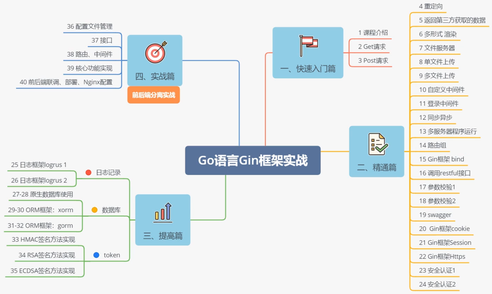

# Go语言学习笔记 Day13

### [Day12](http://njgit.jsaepay.com/wangwei/golang-study/src/branch/master/huqi/Day_12)
### [End](http://njgit.jsaepay.com/wangwei/golang-study/src/branch/master/huqi/MyGoProject)

    1、学习使用HMAC签名方法
    2、学习使用RSA签名方法
    3、学习使用ECDSA签名方法
    4、学习使用配置文件管理
    
### Day14
    
    1、学习使用接口管理
    2、学习使用路由中间件配置
    3、完成核心功能实现
    4、完成前后端联调

